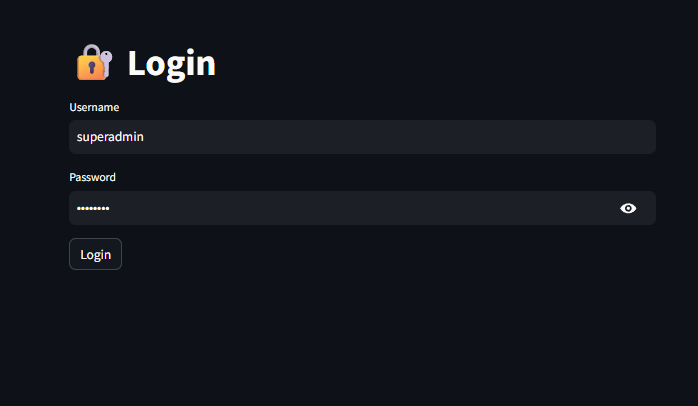
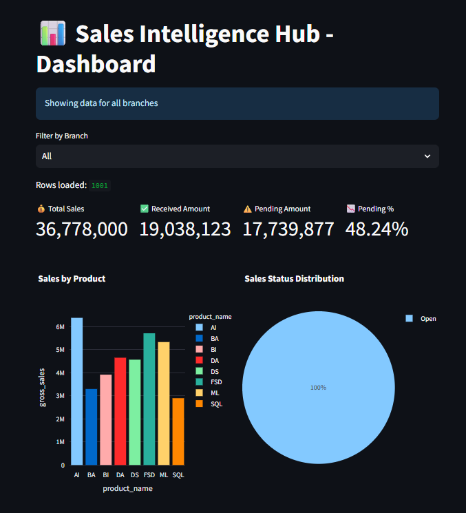
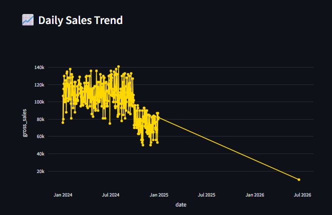
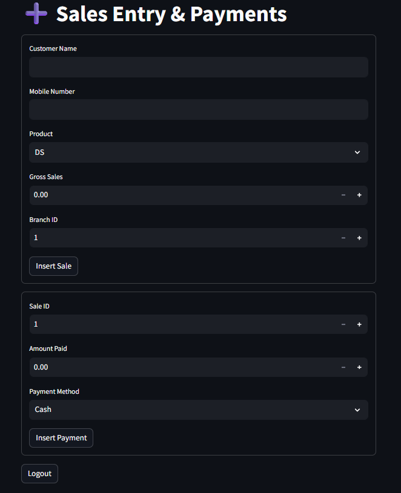
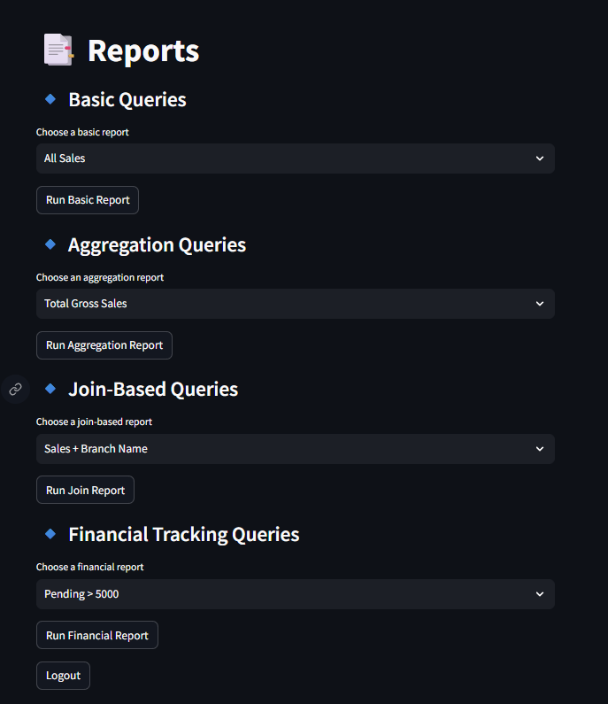

# Sales Intelligence Hub 📊

A **Streamlit-powered analytics dashboard** for managing and visualizing sales data.  
This project integrates **dynamic SQL queries, branch filters, and financial tracking** to provide actionable insights for businesses.

---

## 🚀 Features
- **Authentication & Navigation** → Secure login with sidebar navigation.
- **Dashboard** → Quick overview of sales performance.
- **Sales Entry** → Add new sales records with payment splits.
- **Reports Page** → Organized into four categories:
  - 🔹 **Basic Queries** → View all sales, branches, payments, open sales, and branch-specific sales.
  - 🔹 **Aggregation Queries** → Totals, averages, and counts across sales and branches.
  - 🔹 **Join-Based Queries** → Sales with branch names, payments, admins, and grouped summaries.
  - 🔹 **Financial Tracking Queries** → Pending amounts, top sales, monthly summaries, and payment method collections.
- **Dynamic Filters**:
  - Branch filter → Select any branch instead of hardcoding.
  - Date range filter → Customize monthly sales summary.
- **Interactive Charts** → Auto-generated bar, pie, and line charts using Plotly.

---

## 🛠️ Tech Stack
- **Python 3.10+**
- **Streamlit** (UI framework)
- **MySQL** (database)
- **Pandas** (data handling)
- **Plotly Express** (visualizations)

---


## 📂 Project Structure

SALES_INTELLIGENCE_HUB/
│
├── dashboard/
│   ├── app.py
│   ├── dashboard_page.py
│   ├── load_csv_to_mysql.py
│   ├── load_users.py
│   ├── login.py
│   ├── query_reports.py
│   ├── sales_entry_page.py
│
├── datasets/
│   ├── branches.csv
│   ├── customer_sales.csv
│   ├── payment_splits.csv
│   └── users.csv
│
├── schema.sql
├── reports.sql
├── requirements.txt
├── README.md
├── LICENSE
└── images/
    └── image.png


```
## ⚙️ Setup Instructions
1. **Clone the repository**
   ```bash
   git clone https://github.com/devipriya02122-beep/Sales_Intelligence_Hub 
   cd Sales_Intelligence_Hub
   ```

2. **Create virtual environment**
   ```bash
   python -m venv venv
   venv\Scripts\activate     
   ```

3. **Install dependencies**
   ```bash
   pip install -r requirements.txt
   ```

4. **Run the app**
   ```bash
   streamlit run dashboard/app.py
   ```

---

## 📸 Screenshots






## 📜 License
This project is licensed under the **MIT License** — free to use and modify.

---

## 👩‍💻 Author
**Devi Priya**  
Aspiring Data Analyst | Python & SQL Enthusiast | Streamlit Developer
